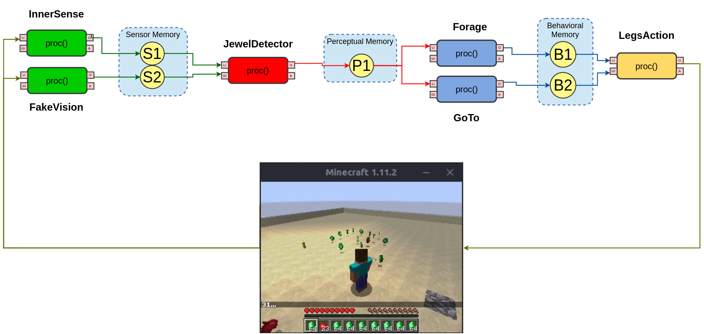
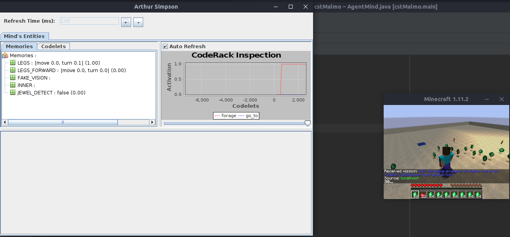
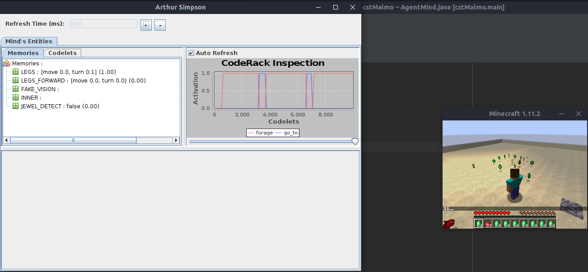

# CST agent example with Malmö

## requirements
 - Java 8
   - although CST support more recent versions, Malmö itself uses an old gradle version, which supports up to Java 8
 - Gradle

## CST
The CST Toolkit is a Java-based toolkit to allow the construction of Cognitive Architectures. It has been developed at the University of Campinas by a group of researchers in the field of Cognitive Architectures led by Prof. Ricardo Gudwin.

Note: This library is still under development, and some concepts or features might not be available yet. Feedback/bug report and Pull Requests are most welcome!

More info can be found in [CST github page](https://github.com/cst-group/cst)!

## Malmö Platform

Project Malmö is a platform for Artificial Intelligence experimentation and research built on top of Minecraft. We aim to inspire a new generation of research into challenging new problems presented by this unique environment.

More info on [Malmö github page](https://github.com/microsoft/malmo)!

## Running the example

First, you need to run Malmö, as explained [here](https://github.com/Microsoft/malmo/blob/master/Malmo/samples/Python_examples/Tutorial.pdf)

**Important**
There are two important things to run this example. 
- You have to point the "libMalmoJava.so" (or ".dll", if using windows) to the Java path. This can be done by using the -Djava option to the JVM. As this file already is on this repo, you may use somethings like **-Djava.library.path=<path/to/this/repo>/resources**.
- You also have to define two environmental variables: MALMO_XSD_PATH and MALMO_HOME, pointing respectively to Malmo Schemas and to home directory of your Malmo release. This can be done, for example, by adding **MALMO_XSD_PATH=<path/to/Malmo/repo>/Schemas;MALMO_HOME=<path/to/Malmo/repo>** on your IDE running configuration or by adding them (with "export ...") to your **~./bashrc** file and source it.

Then you run the program, either the traditional way or through a fatJar. The agent should appear and turn right searching for emeralds on its line of sight (a very specific point) and go toward the jewel, once detected.
Each run takes about 40 seconds. Also, a Mind Viewer will pop-up where an user can see Memories and Codelets contents and Codelets activation levels.

Note that the first run will take more time, as Malmö loads the environment.

### Agent diagram

 
 

### Running example (with mindviewer on the left)

 
 

